# PRD: HR FAQ Agent — Google Cloud Retrieval & Search Architecture Comparison Demo

**Author:** xavierprasetyo  
**Date:** October 2, 2026  
**Status:** Approved & In Implementation  

---

## 1. Executive Summary & Naming Decoder

This demo builds the same HR FAQ assistant five ways on Google Cloud to make one thing visible: **every step up in abstraction trades control for less code and less infrastructure.** It does not rank the scenarios. Each card shows what we built, what Google managed, and what we gave up.

> [!NOTE]
> **Naming as of October 2026.** At Next '26 (GA April 22, 2026), Vertex AI was renamed **Gemini Enterprise Agent Platform**. Product names changed, but **API endpoints and SDK packages did not**, so code and docs still mix old and new names:
>
> | Current Name | Formerly | API / SDK (unchanged) |
> | :--- | :--- | :--- |
> | Gemini Enterprise Agent Platform | Vertex AI | `aiplatform.googleapis.com`, `google-cloud-aiplatform` |
> | Vector Search | Vertex AI Vector Search ("1.0") | `aiplatform` `IndexService` / `IndexEndpointService` |
> | Agent Retrieval | Vector Search 2.0 | `vectorsearch.googleapis.com/v1` |
> | RAG Engine | Vertex AI RAG Engine | `vertexai.rag` |
> | Agent Search | Vertex AI Search / AI Applications | `discoveryengine.googleapis.com` |
> | Agent Runtime | Agent Engine | `reasoningEngines` |
>
> Scenarios 4 and 5 use **the same Agent Search data store**. The difference is who drives it: Agent Search's own search/answer API (4), or a Gemini agent built with ADK that calls it as a tool (5).
>
> *Console labels are still catching up with the rename. Depending on rollout, Agent Search may appear as "Vertex AI Search", "AI Applications", or "Search" under Agent Platform → Agents → Build.*

### Shared Defaults (Held Constant Across Scenarios)

| Setting | Value |
| :--- | :--- |
| Languages | **Two separate demos:** English (`en`, this document) and Bahasa Indonesia (`id`, localized dataset in [indonesia-version/PRD.md](../indonesia-version/PRD.md)). Each language gets its own documents, questions, and retrieval resources; no cross-lingual querying. |
| LLM | `gemini-3.8-flash` (supports both languages; prompts instruct it to answer in the question's language) |
| Embedding model (Scenarios 1–2) | `gemini-embedding-2`, 768 dims, both languages (multilingual). Uses **text prefixes instead of `task_type`**: documents `title: {title} \| text: {content}`, questions `task: question answering \| query: {content}`. Served **only at the `global` location**. |
| Embedding model (Scenario 3) | English corpus: `text-embedding-005` (English-only). Indonesian corpus: `text-multilingual-embedding-002`. Both **retire April 1, 2027**. RAG Engine does not yet accept Gemini embedding models, even though they appear in the platform-wide embedding model list. |
| Embedding model (Scenarios 4–5) | Google-managed inside Agent Search (not configurable). One data store per language, as Google recommends; Indonesian (`id-ID`) is officially supported for search, answers, and follow-ups. |
| Region | `us-central1` *(confirm Agent Retrieval availability)* |

> [!NOTE]
> **The embedding model is deliberately *not* held constant.** In testing (October 2, 2026; `us-central1` Serverless mode and `europe-west4` Spanner mode), RAG Engine rejected `gemini-embedding-001` with *"Publisher model is not allowed for use in Vertex RAG yet."* It also cannot use `gemini-embedding-2`: that model is served only at `global`, and RAG Engine requires the embedding model to be in the corpus's region (*"Vertex Prediction endpoint is not in the same region as the service call"*). Agent Retrieval auto-embedding accepted `gemini-embedding-2`. This narrower choice of embedding model is itself one of RAG Engine's trade-offs; re-check before the demo, since support may change. `text-multilingual-embedding-002` was tested with an Indonesian chunk and question in `us-central1` and worked.

### The 5 Scenarios at a Glance

| # | Scenario | Product / API | You Own | You Give Up |
| :--- | :--- | :--- | :--- | :--- |
| 1 | **Vector Search (1.0)** | Vector Search · `IndexService` + `MatchService` | Parsing, chunking, embedding calls, a separate chunk-text store, prompting, and an always-on endpoint | Nothing in control; you pay in code, a 20–40 min deploy, and 24/7 endpoint cost |
| 2 | **Agent Retrieval** | Agent Retrieval · `vectorsearch_v1` Collections + DataObjects | Parsing, chunking, prompting | Index-level tuning and dedicated shard/VPC control (traded for serverless) |
| 3 | **RAG Engine** | RAG Engine · `RagCorpus` | Corpus configuration (chunk size, parser, embedding model) | Per-chunk metadata modeling, record-level updates, custom chunking logic, and Gemini embedding models (limited to `text-embedding-005` and older) |
| 4 | **Agent Search: Search & Answer API** | Agent Search · Discovery Engine `search` / `answer_query` | One API call (or the web widget) | Chunking and embedding control, the choice of answer model, custom actions |
| 5 | **Agent Search + ADK Agent** | Same data store as #4 · `google-adk` `VertexAiSearchTool` | Agent definition, instructions, and HR action tools | Predictable single-call latency and cost (agents may make several model and tool calls per turn) |

---

## 2. Responsibility Matrix: What Google Manages vs. What We Build

The core goal of our HR FAQ Agent demo is to make this table tangible through 5 live GCP implementations.

```mermaid
flowchart LR
    subgraph VS1["1. Vector Search 1.0"]
        direction TB
        V1_B["We Build: Parse, Chunk, Embed, External Text DB, Prompt"]
        V1_G["Google Manages: ScaNN Index + Endpoint"]
    end
    subgraph VS2["2. Agent Retrieval (VS 2.0)"]
        direction TB
        V2_B["We Build: Parse, Chunk, Prompt"]
        V2_G["Google Manages: Collections, Payload + Vector Store, Auto-Embed"]
    end
    subgraph RAG["3. RAG Engine"]
        direction TB
        R_B["We Build: Corpus Config + Gemini Call"]
        R_G["Google Manages: GCS Import, Parse, Chunk, Embed, Vector DB"]
    end
    subgraph SEARCH["4. Agent Search API"]
        direction TB
        S_B["We Build: 1 Answer API Call"]
        S_G["Google Manages: Full Pipeline + Hybrid Ranking + Answer Synthesis"]
    end
    subgraph AGENT["5. Agent Search + ADK"]
        direction TB
        A_B["We Build: ADK Agent + HR Action Tools"]
        A_G["Google Manages: Agent Search Data Store + Grounded Retrieval"]
    end
    VS1 --> VS2 --> RAG --> SEARCH --> AGENT
```



| RAG / Agent Pipeline Stage | 1. Vector Search 1.0 | 2. Agent Retrieval *(Vector Search 2.0)* | 3. RAG Engine | 4. Agent Search *(Search & Answer API)* | 5. Agent Search *(+ ADK Agent)* |
| :--- | :--- | :--- | :--- | :--- | :--- |
| **Document Ingestion** | **We Build** (Read local/GCS files) | **We Build** (Read local/GCS files) | **Google Manages** (`rag.import_files` from GCS) | **Google Manages** (GCS Data Store sync) | **Google Manages** (Reuses Data Store from #4) |
| **PDF & Table Parsing** | **We Build** (`pypdf` / custom parser) | **We Build** (`pypdf` / custom parser) | **Google Manages** (Built-in / Document AI Layout Parser) | **Google Manages** (Built-in Layout & OCR Parser) | **Google Manages** (Built-in Layout & OCR Parser) |
| **Chunking Strategy** | **We Build** (Custom Python splitter) | **We Build** (Custom Python splitter) | **Google Manages** (`chunk_size`, `chunk_overlap`) | **Google Manages** (Auto layout-aware chunking) | **Google Manages** (Auto layout-aware chunking) |
| **Embedding Generation** | **We Build** (Call `gemini-embedding-2` at the `global` location, with text prefixes) | **Google Manages / Optional** (Collection auto-embeds with `gemini-embedding-2`, or BYO) | **Google Manages** (Auto-calls `text-embedding-005` for EN, `text-multilingual-embedding-002` for ID; Gemini embedding models not yet allowed) | **Google Manages** (Built-in domain-tuned embeddings) | **Google Manages** (Built-in domain-tuned embeddings) |
| **Chunk Text / Payload Storage** | **We Build** (Index only returns IDs; we store chunk text in GCS/JSON/Firestore) | **Google Manages** (`DataObjects` store JSON text payload + vector together) | **Google Manages** (`RagManagedDb` stores text + vectors) | **Google Manages** (Discovery Engine Data Store) | **Google Manages** (Discovery Engine Data Store) |
| **Infrastructure Provisioning** | **Index + Endpoint VM** (20–40 min deploy) | **Serverless Collection** (Instant creation) | **Managed Corpus** (Instant creation) | **Managed Data Store** (5–15 min indexing) | **Managed Data Store** (Reuses #4) |
| **Search & Ranking Algorithm** | **Pure ANN** (Unless we manually build sparse+dense hybrid) | **Dense + Sparse Hybrid** & metadata filtering | **Vector Similarity** + optional Ranking API reranker | **Google Hybrid Search** (BM25 + Vector + Reranking + Spellcheck) | **Google Hybrid Search** (BM25 + Vector + Reranking) |
| **Prompting & Answer Synthesis** | **We Build** (Lookup text by ID, build prompt, call Gemini) | **We Build** (Extract `DataObject` text, build prompt, call Gemini) | **Google / We Build** (Pass `rag.Retrieval` tool to `generate_content`) | **Google Manages** (`AnswerQuery` API synthesizes answer + citations) | **Google Manages** (ADK Agent + `VertexAiSearchTool` synthesizes answer) |
| **Multi-Step Reasoning & Actions** | **We Build** (Custom loop) | **We Build** (Custom loop) | **We Build** (Custom loop) | **No custom tools** (Q&A over docs only) | **We Build in ADK** (Combines policy search with live HR API tools) |

---

## 3. Shared Demo Dataset & Golden Evaluation Queries

To make the trade-offs of each of the 5 scenarios visible on real GCP infrastructure, we will generate and upload the **"Cymbal Corp HR Policy Suite" (4 PDF documents)** to [`source-documents/`](source-documents/). The Indonesian demo uses its own localized set in [`indonesia-version/source-documents/`](../indonesia-version/source-documents/).

1. **`01_Global_PTO_and_Leave_Policy.pdf`**
   - Narrative text covering PTO accrual tiers by tenure, parental leave, bereavement leave, and carryover limits.
2. **`02_2026_Benefits_and_Healthcare_Guide.pdf`**
   - Contains **multi-column tables** comparing Medical Plans (HDHP vs. PPO deductibles, out-of-pocket max, HSA employer match).
3. **`03_Expense_and_Travel_Reimbursement_Policy.pdf`**
   - Contains **exact policy codes, acronyms, and thresholds** (e.g., Form `EXP-402B`, per-diem caps by city tier, VP approval rules above `\$250`).
4. **`04_Remote_Work_and_Equipment_Stipend_FAQ.pdf`**
   - Q&A formatted document covering home office stipends (`\$1,000` every 3 years), international work-from-anywhere rules (up to 20 workdays/year), and IT security approval.

### Indonesian Version

The Indonesian demo is specified in **[indonesia-version/PRD.md](../indonesia-version/PRD.md)**. It is **localized, not translated**: its documents use Indonesian HR concepts and terms (BPJS, THR, SPPD, cuti bersama, WFA, Rupiah), and its own Q1-ID–Q4-ID questions follow the same four test patterns as Q1–Q4. Answers therefore differ between the two demos; what carries over is how each architecture behaves.

Each language has its own retrieval resources, suffixed `-en` / `-id`:

| Scenario | English | Indonesian |
| :--- | :--- | :--- |
| 1. Vector Search 1.0 | `hr-faq-index-en` (+ chunk store) | `hr-faq-index-id` (+ chunk store); both can be deployed to the same endpoint |
| 2. Agent Retrieval | `hr-faq-en` collection | `hr-faq-id` collection |
| 3. RAG Engine | `hr-faq-rag-en` (`text-embedding-005`) | `hr-faq-rag-id` (`text-multilingual-embedding-002`) |
| 4–5. Agent Search | `hr-faq-datastore-en` | `hr-faq-datastore-id` |

### Golden Test Queries (Designed to Expose Architectural Differences)

| Query ID | User Question | Trade-off Revealed |
| :--- | :--- | :--- |
| **Q1 (Pure Semantic)** | *"I just welcomed a new child—how many weeks of paid leave do primary caregivers get?"* | **All 5 Scenarios** handle semantic similarity ("welcomed a new child" $\rightarrow$ "Parental Leave"), letting you compare the **developer effort & latency** across Vector Search 1.0, Agent Retrieval, RAG Engine, the Agent Search API, and Agent Search + ADK. |
| **Q2 (Exact Code / Keyword)** | *"What is Form EXP-402B used for and what is the submission deadline?"* | Highlights **Scenarios 4 & 5 (Agent Search)** native hybrid keyword+vector indexing vs. pure dense vector search in **Scenario 1 (Vector Search 1.0)** vs. hybrid search in **Scenario 2 (Agent Retrieval)**. |
| **Q3 (Complex Table)** | *"Compare the family deductible and employer HSA contribution between the PPO and HDHP medical plans."* | Highlights managed layout/table parsing in **Scenario 3 (RAG Engine)** and **Scenario 4 (Agent Search API)** vs. basic `pypdf` text extraction in **Scenarios 1 & 2**. |
| **Q4 (Agentic Multi-Hop + HR Tool)** | *"I'm employee EMP-1042. Can I work remotely from Japan for 15 workdays next month, and do I have enough PTO balance to take 5 extra vacation days while there?"* | Showcases **Scenario 5 (Agent Search + ADK)**: the agent searches the Remote Work policy via `VertexAiSearchTool` AND calls the live Python tool `get_employee_pto_balance("EMP-1042")` to answer both parts. |

For the Indonesian questions (Q1-ID–Q4-ID), see [indonesia-version/PRD.md §4](../indonesia-version/PRD.md).

---

## 4. Detailed Implementation Blueprint (5 Live GCP Scenarios)

### Scenario 1: Vector Search 1.0 (`MatchingEngineIndex` + `IndexEndpoint`)
* **Where in GCP Console:** `Agent Platform → Agents → Build → Vector Search` (Vector Search 1.0 indexes)
* **What the Service Actually Does:** Provides a pure Approximate Nearest Neighbor (ANN) vector index (`ScaNN`) hosted on a dedicated `MatchingEngineIndexEndpoint` VM replica. **Critically, Vector Search 1.0 only stores `(datapoint_id, float_vector)` pairs—it does NOT store your raw document text!**
* **What You Must Build Yourself (~145 LOC):**
  1. **PDF & Table Parser:** Extract text from PDFs yourself (`pypdf` / Document AI).
  2. **Chunking Pipeline:** Write your own text splitter (e.g., 500-char chunks with 80-char overlap).
  3. **Embedding Pipeline:** Call `gemini-embedding-2` in batches through a **`global`-location client** (the model is not served in `us-central1`, even though the index is), formatting each text with the document or question prefix.
  4. **External Chunk Text Database:** Store `{chunk_id: {text, source_doc, page}}` in your own database (Firestore, Cloud SQL, or GCS JSON) so you can translate the `datapoint_id`s returned by Vector Search back into readable text.
  5. **Endpoint Provisioning:** Create the `MatchingEngineIndex`, create the `MatchingEngineIndexEndpoint`, and wait ~20–30 minutes for `deploy_index` to spin up the serving VM.
  6. **Query & Prompt Assembly:** Embed the user's question $\rightarrow$ call `endpoint.find_neighbors()` $\rightarrow$ look up the raw text in your external DB $\rightarrow$ build the prompt $\rightarrow$ call `gemini-3.8-flash`.

```python
# Scenario 1 Reference Flow (Vector Search 1.0)
chunks = parse_and_chunk_pdfs("../source-documents/*.pdf")  # one index per language
# gemini-embedding-2 is only served at the global location; prefixes replace task_type
embed_client = genai.Client(vertexai=True, project=PROJECT_ID, location="global")
embed_cfg = types.EmbedContentConfig(output_dimensionality=768)
embeddings = embed_client.models.embed_content(
    model="gemini-embedding-2",
    contents=[f"title: {c['source_doc']} | text: {c['text']}" for c in chunks],
    config=embed_cfg,
).embeddings

# Must store text externally because VS 1.0 only stores vector IDs + floats
save_to_firestore_or_json({c["chunk_id"]: c for c in chunks})
vs1_index.upsert_datapoints([IndexDatapoint(datapoint_id=c["chunk_id"], feature_vector=v.values) for c, v in zip(chunks, embeddings)])

# At Query Time:
q_vec = embed_client.models.embed_content(
    model="gemini-embedding-2", contents=f"task: question answering | query: {question}", config=embed_cfg,
).embeddings[0].values
neighbors = vs1_endpoint.find_neighbors(deployed_index_id="hr_faq_deployed", queries=[q_vec], num_neighbors=4)
context_texts = [external_chunk_db[n.id]["text"] for n in neighbors[0]]
answer = genai_client.models.generate_content(model="gemini-3.8-flash", contents=build_prompt(question, context_texts))
```

---

### Scenario 2: Agent Retrieval, formerly Vector Search 2.0 (`Collections` + `DataObjects`)
* **Where in GCP Console:** `Agent Platform → Agents → Build → Vector Search` (Agent Retrieval / Vector Search 2.0)
* **What the Service Actually Does:** Evolves Vector Search into a **serverless, unified vector + JSON document database**. Instead of managing bare indexes and VM endpoints, you create a `Collection` of `DataObjects` that store **both the JSON text payload and the vector embedding together**, with optional **auto-embeddings** (`VertexEmbeddingConfig`) and built-in hybrid search (`SemanticSearch` + `TextSearch` + Reciprocal Rank Fusion).
* **What You Still Build Yourself (~65 LOC):**
  1. **PDF & Table Parser + Chunker:** Because it is a database rather than a document ingestion pipeline, you still parse PDFs and split text into chunks before inserting `DataObjects`.
  2. **Prompt Assembly & LLM Call:** You retrieve the matching `DataObjects` (which now include `data["text"]` directly in the response!) and pass them to `gemini-3.8-flash`.
  * *(Eliminated vs. Vector Search 1.0: No external chunk database, no manual embedding API calls, and no 20-minute `IndexEndpoint` VM deployment).*

```python
# Scenario 2 Reference Flow (Vector Search 2.0 / Agent Retrieval)
# 1. Collection auto-embeds via vertex_embedding_config:
#    model_id="gemini-embedding-2", text_template="title: {source_doc} | text: {text}", dimensions=768
#    and stores JSON payload + vector together
for chunk in parse_and_chunk_pdfs("../source-documents/*.pdf"):  # one collection per language
    do_client.create_data_object(
        parent=collection_name,
        data_object_id=chunk["chunk_id"],
        data_object=vs2.DataObject(data=chunk, vectors={}),  # Server auto-generates embedding!
    )

# 2. At Query Time: SemanticSearch auto-embeds the query and returns payload + vector match in one call
resp = search_client.search_data_objects(vs2.SearchDataObjectsRequest(
    parent=collection_name,
    semantic_search=vs2.SemanticSearch(
        search_text=question, search_field="embedding", top_k=4,
        output_fields=vs2.OutputFields(data_fields=["text", "source_doc", "page_num"])
    )
))
context_texts = [r.data_object.data["text"] for r in resp.results]
answer = genai_client.models.generate_content(model="gemini-3.8-flash", contents=build_prompt(question, context_texts))
```

---

### Scenario 3: Vertex AI RAG Engine (`RagCorpus`)
* **Where in GCP Console:** `Agent Platform → Agents → Build → RAG Engine`
* **What the Service Actually Does:** Acts as **managed RAG middleware** for developers. You point `rag.import_files()` at a GCS bucket or Google Drive folder of raw PDFs, and RAG Engine automatically parses the documents, chunks the text according to your `ChunkingConfig`, generates embeddings, stores them in `RagManagedDb` (or a linked Vector Search index), and exposes the corpus as a native `VertexRagStore` tool inside Gemini's `generate_content` API.
* **What You Build Yourself (~30 LOC):**
  1. **Corpus Creation & Import Call:** Pick the embedding model per language (`text-embedding-005` for English, `text-multilingual-embedding-002` for Indonesian; Gemini embedding models are rejected), configure `chunk_size` and `chunk_overlap`, and pass your GCS URIs.
  2. **Gemini Inference Call:** Attach `Tool(retrieval=Retrieval(vertex_rag_store=...))` to `gemini-3.8-flash`.
  * *(Eliminated vs. Vector Search 2.0: No custom PDF parsing code, no chunking loops, and no manual context string concatenation).*

```python
# Scenario 3 Reference Flow (Vertex AI RAG Engine)
# Embedding model is fixed for the corpus lifetime; Gemini embedding models are not yet allowed
RAG_EMBEDDING_MODEL = {"en": "text-embedding-005", "id": "text-multilingual-embedding-002"}
corpus = rag.create_corpus(
    display_name=f"hr-faq-rag-{lang}",
    backend_config=rag.RagVectorDbConfig(
        rag_embedding_model_config=rag.RagEmbeddingModelConfig(
            vertex_prediction_endpoint=rag.VertexPredictionEndpoint(
                publisher_model=f"publishers/google/models/{RAG_EMBEDDING_MODEL[lang]}"
            )
        )
    ),
)
rag.import_files(
    corpus_name=corpus.name,
    paths=[f"gs://my-bucket/hr-docs/{lang}/"],
    transformation_config=rag.TransformationConfig(
        chunking_config=rag.ChunkingConfig(chunk_size=512, chunk_overlap=100)
    ),
)

# At Query Time: Native tool attachment in Gemini generate_content
rag_tool = types.Tool(retrieval=types.Retrieval(
    vertex_rag_store=types.VertexRagStore(
        rag_resources=[types.VertexRagStoreRagResource(rag_corpus=corpus.name)],
        similarity_top_k=4,
    )
))
response = genai_client.models.generate_content(
    model="gemini-3.8-flash", contents=question, config=types.GenerateContentConfig(tools=[rag_tool])
)
```

---

### Scenario 4: Agent Search — Search & Answer API (formerly Vertex AI Search)
* **Where in GCP Console:** Agent Search (console may still show `Vertex AI Search` / `AI Applications`) — Discovery Engine API
* **What the Service Actually Does:** Provides a **complete, end-to-end Enterprise Search and Q&A application**. When you connect a `DataStore` to GCS (or SaaS connectors like SharePoint, Confluence, Drive, Workday), Google automatically runs OCR & layout-aware table parsing, chunking, hybrid keyword (BM25) + dense vector indexing, spell correction, synonym expansion, cross-encoder semantic reranking, extractive answer highlighting, and grounded LLM summary synthesis with inline citations.
* **What You Build Yourself (~18 LOC, or 0 LOC with Web Widget):**
  1. Point one Unstructured `DataStore` and `Engine` per language at `gs://my-bucket/hr-docs/en/` and `gs://my-bucket/hr-docs/id/` (Google recommends one data store per language).
  2. Make a single `SearchServiceClient.search()` (or `ConversationalSearchServiceClient.answer_query()`) call—or embed the `<gen-search-widget>` HTML tag directly into an HR portal.

```python
# Scenario 4 Reference Flow (Turnkey Vertex AI Search)
search_client = discoveryengine.SearchServiceClient()
response = search_client.search(discoveryengine.SearchRequest(
    serving_config=f"{engine_name}/servingConfigs/default_search",
    query=question,
    page_size=4,
    content_search_spec=discoveryengine.SearchRequest.ContentSearchSpec(
        extractive_content_spec=discoveryengine.SearchRequest.ContentSearchSpec.ExtractiveContentSpec(
            max_extractive_answer_count=2, max_extractive_segment_count=2
        ),
        summary_spec=discoveryengine.SearchRequest.ContentSearchSpec.SummarySpec(
            summary_result_count=4, include_citations=True,
            language_code=lang,  # "en" or "id"
        ),
    ),
))
answer_with_citations = response.summary.summary_text
```

---

### Scenario 5: Agent Search + Google ADK (`VertexAiSearchTool` + Custom HR Tools)
* **Where in GCP Console:** Agent Search data store (same as Scenario 4) + Google Agent Development Kit (`google-adk`)
* **What the Service Actually Does:** The **Agent Search** (formerly Vertex AI Search) `DataStore` from Scenario 4 can also be plugged directly into a reasoning agent via ADK's `VertexAiSearchTool` (the class name is unchanged after the rename). While Scenario 4 is a passive search/Q&A bar over static documents, Scenario 5 turns the HR assistant into an **active agent** that combines **Agent Search policy retrieval** with **live transactional HR tools** (like checking an employee's real-time PTO balance or submitting a leave request).
* **What You Build Yourself (~55 LOC):**
  1. Reuse the **Agent Search `DataStore`** created in Scenario 4 (zero duplicate indexing).
  2. Write Python functions for live HR system APIs (`get_employee_pto_balance`, `check_expense_approval_tier`).
  3. Define a Google ADK `Agent` equipped with both the Agent Search tool and your HR action tools.

```python
# Scenario 5 Reference Flow (Agent Search + Google ADK)
from google.adk.agents import Agent
from google.adk.tools import VertexAiSearchTool

def get_employee_pto_balance(employee_id: str) -> dict:
    """Fetches live accrued PTO balance and WFA days used from the HRIS database."""
    return HRIS_DB[employee_id]

hr_agent = Agent(
    name="cymbal_hr_agent",
    model="gemini-3.8-flash",
    instruction=(
        "Use Agent Search to look up official Cymbal Corp HR policies, and call "
        "get_employee_pto_balance when an employee asks about their personal eligibility or leave balance."
    ),
    tools=[
        VertexAiSearchTool(data_store_id=DATA_STORE_PATH[lang], bypass_multi_tools_limit=True),  # one agent per language
        get_employee_pto_balance,
    ],
)
```

---

## 5. Proposed Demo Dashboard Design (For Future Implementation)

* **Backend:** Python **FastAPI** server exposing `POST /api/query` (with a `lang` field, `en` or `id`) to compare responses, retrieved chunks, and execution traces across all 5 scenarios, routed to that language's resources.
* **Frontend:** Single-page comparison UI displaying:
  * **Language toggle (English / Bahasa Indonesia)** that switches the preset questions, the target resources, and the answer language.
  * **Preset Golden Questions (`Q1`–`Q4`, `Q1-ID`–`Q4-ID`)** + custom query bar.
  * **5 Scenario Cards** showing side-by-side answers, retrieved context excerpts, and a **"What We Built vs. What Google Managed"** code inspector.

---

## 6. Decision Guide: Choosing Between the Scenarios

### 6.1 Scenario 3 (RAG Engine) vs. Scenario 4 (Agent Search API) vs. Scenario 5 (Agent Search + ADK)

| Decision Dimension | Scenario 3: RAG Engine (`RagCorpus`) | Scenario 4: Agent Search API (formerly Vertex AI Search) | Scenario 5: Agent Search + ADK (`VertexAiSearchTool` + `google-adk`) |
| :--- | :--- | :--- | :--- |
| **Primary Goal** | Build a **custom LLM app over files** where developers control chunking, embeddings, and prompts via a simple SDK. | Deploy a **Search Bar & Q&A Portal** over enterprise docs with minimal code. | Build a **multi-step AI Agent** that combines document lookup with **live API actions**. |
| **Retrieval Mechanism** | Dense vector similarity (`RagManagedDb`) + optional Reranker. | **Google Hybrid Search** (BM25 keyword + vector + spellcheck + cross-encoder reranking). | **Google Hybrid Search** (same DataStore as Scenario 4) invoked dynamically by an Agent. |
| **Chunking & Embedding Control** | **High:** You set exact `chunk_size`, `chunk_overlap`, parser type (`LayoutParser` / `LlmParser`), and embedding model (from the RAG-supported list: `text-embedding-005` and older; Gemini embedding models not yet allowed). | **Managed / Black-Box:** Google automatically tunes layout chunking and embeddings. | **Managed / Black-Box:** Uses the same managed DataStore pipeline as Scenario 4. |
| **Enterprise Connectors & ACLs** | Basic (GCS, Google Drive, Slack, Jira, SharePoint via import API). | **Extensive:** 1P/3P SaaS connectors with native document-level ACL enforcement. | **Extensive:** Inherits DataStore connectors and ACLs. |
| **Can Call External APIs / Take Actions?** | Only if you wire it into a custom agent/function-calling loop yourself. | **No** — answers questions strictly from indexed documents. | **Yes (Core Strength)** — Agent combines doc search with live HRIS/ERP/ticketing APIs. |
| **HR Demo Example** | Custom HR chatbot where you want to tune 256-token vs. 512-token chunks or swap vector DBs. | Employee intranet HR search bar ("Search HR Policies & get an AI Summary"). | Personal HR Concierge ("Check my Workday PTO balance, verify Japan WFA rules, and file ticket SEC-WFA-99"). |

---

### 6.2 Scenario 2 (Vector Search 2.0) vs. Scenario 3 (Vertex AI RAG Engine)

At first glance, **Scenario 2 (`Vector Search 2.0`)** and **Scenario 3 (`RAG Engine`)** look very similar because both live under the developer-centric *Agent Platform* menu and both can auto-generate embeddings. The fundamental difference is **what unit of data they manage**:

* **Scenario 3 (RAG Engine) is a *File-Centric Ingestion Pipeline* (`RagFile`):** You give it **raw files** (PDFs, Google Docs, HTML in GCS/Drive), and it parses, chunks, and embeds them for you.
* **Scenario 2 (Vector Search 2.0) is a *Record-Centric Vector + JSON Database* (`DataObject`):** It does **not** open PDFs or chunk documents. Instead, you feed it structured JSON objects (`{text, department, country, min_level, ...}`), and it gives you millisecond CRUD, rich metadata filtering, and hybrid vector + keyword search (`SemanticSearch` + `TextSearch` + Reciprocal Rank Fusion).

| Decision Dimension | Scenario 2: Vector Search 2.0 (`Collections` + `DataObjects`) | Scenario 3: Vertex AI RAG Engine (`RagCorpus` + `RagFile`) |
| :--- | :--- | :--- |
| **Unit of Storage** | **JSON Record (`DataObject`)** with a typed `data_schema` + auto-embedded vector field(s). | **Document File (`RagFile`)** stored in GCS or Google Drive and automatically split into chunks. |
| **PDF Parsing & Chunking** | **You build it** (great when you need custom section-header chunking or custom metadata enrichment per chunk). | **Google manages it** (`rag.import_files` with configurable `chunk_size`, `chunk_overlap`, and `LayoutParser`). |
| **Metadata Filtering** | **Rich & Chunk-Level:** Filter on any JSON field (`country == "JP" AND job_level >= 5`) during vector search. | **Limited / File-Level:** Filtering is primarily scoped to `RagFile` IDs rather than arbitrary structured JSON fields per chunk. |
| **Search Modality** | **Hybrid Search Built-In:** Combine `SemanticSearch` (vectors) + `TextSearch` (keywords) with Reciprocal Rank Fusion (`rrf`). | **Dense Vector Search** (+ optional semantic reranker). |
| **Update Granularity** | **Millisecond CRUD per record:** Upsert, update, or delete a single `DataObject` (`chunk_id`) in real time. | **File-level batch import:** Updating a policy paragraph requires re-importing the file. |
| **Best HR Use Case** | 1. **Granular / Metadata-Heavy Records:** Searching 50,000 resolved HR helpdesk tickets or FAQ rows filtered by `employee_country` and `union_status`.<br>2. **Custom Clause Chunking:** Splitting legal contracts by clause (`§4.2`) and tagging each chunk with custom JSON attributes.<br>3. **Agent Long-Term Memory:** Storing and updating facts about an employee across chat sessions in real time. | 1. **Unstructured Document Folders:** Pointing directly at a GCS bucket or Google Drive folder of 200 HR PDF handbooks and getting a working RAG pipeline in 30 lines of code without writing PDF parsers or chunkers. |
| **Where Scenario 1 (Vector Search 1.0) Fits** | Only use **Scenario 1 (`Vector Search 1.0`)** over Scenario 2 when you need **massive-scale pure ANN vector matching** (hundreds of millions to billions of pre-computed embeddings, e.g., recommendation systems, image/biometric similarity) hosted on dedicated, VPC-peered `IndexEndpoint` VMs with custom shard sizing. For new text/agent retrieval workloads, Google positions **Agent Retrieval (Vector Search 2.0) as the successor**, though Vector Search 1.0 is not deprecated and a migration guide is available. | — |