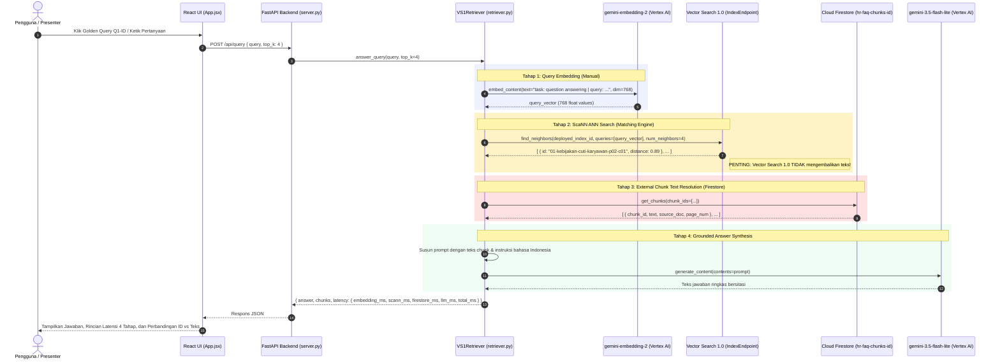

# PRD: Skenario 1 — Vector Search 1.0 (Versi Indonesia)
**Cymbal Corp HR FAQ Agent — Demo Perbandingan Arsitektur Retrieval & Search Google Cloud**

* **Penulis:** xavierprasetyo
* **Tanggal:** 5 Oktober 2026
* **Status:** Disetujui
* **Dokumen Induk:** [indonesia-version/PRD.md](../PRD.md)
* **GCP Project:** `rag-research-sandbox` (Project Number: `1031440951381`)
* **Region / Location:** `us-central1` (Endpoint & Index), `global` (Gemini API & Embeddings)

---

## 1. Ringkasan Eksekutif & Tujuan

Skenario 1 mendemonstrasikan implementasi **Google Cloud Vertex AI Vector Search 1.0** (`MatchingEngineIndex` dan `MatchingEngineIndexEndpoint`). Berbeda dengan sistem pencarian terkelola atau database vektor generasi baru (seperti Skenario 2: Agent Retrieval), Vector Search 1.0 memberikan **kendali teknis maksimal** kepada developer atas setiap tahapan pipeline RAG:
1. Developer mengelola proses parsing PDF dan chunking teks secara mandiri.
2. Developer memanggil API embedding secara manual (`gemini-embedding-2`).
3. **Penyimpanan Teks Terpisah:** Vector Search 1.0 *hanya* menyimpan pasangan `(datapoint_id, feature_vector)`. Layanan ini **tidak menyimpan teks mentah dokumen**. Oleh karena itu, developer wajib menyediakan database dokumen eksternal—dalam implementasi ini menggunakan **Google Cloud Firestore**—untuk menerjemahkan ID hasil pencarian kembali menjadi teks sebelum dikirim ke LLM.
4. Developer mengelola infrastruktur komputasi mesin pencari ScaNN secara eksplisit (penyediaan node VM `e2-standard-2` yang memerlukan waktu deployment 20–30 menit dan penagihan komputasi berkelanjutan).

Tujuan aplikasi ini adalah menyediakan implementasi *full-stack* yang fungsional, transparan, dan dapat diuji secara langsung, mencakup manajemen siklus hidup indeks, pipeline ingesti ke Firestore + Vector Search, REST API FastAPI, antarmuka web interaktif (React + Vite), serta evaluasi otomatis atas pertanyaan baku (Golden Queries).

---

## 2. Diagram Arsitektur & Alur Data

### 2.1 Arsitektur Komponen

```mermaid
flowchart TD
    subgraph ClientLayer["1. Lapisan Presentasi (Frontend)"]
        UI["React 19 + Vite Dashboard (Port 3001 / 8001)<br>- Kartu 1-Click Golden Query (Q1-ID s.d Q4-ID)<br>- Pengukur Latensi Granular (Embedding, ScaNN, Firestore, LLM)<br>- Datapoint ID vs Resolved Text Inspector<br>- Indikator Status & Biaya Endpoint VM"]
    end

    subgraph ServiceLayer["2. Lapisan Aplikasi & API (Backend)"]
        FastAPIApp["FastAPI Server (server.py - Port 8001)<br>- Endpoints: /api/query, /api/health, /api/status, /api/golden-queries<br>- Penyaji Berkas Statis Frontend (/dist)"]
        RetrieverCore["VS1Retriever (retriever.py)<br>- Orkes Alur 4 Tahap: Embed → ScaNN → Firestore → LLM"]
        FastAPIApp --> RetrieverCore
    end

    subgraph ExternalDB["3. Penyimpanan Teks Chunk Eksternal"]
        FirestoreDB[("Google Cloud Firestore<br>Collection: hr-faq-chunks-id<br>- Kunci: chunk_id<br>- Dokumen: text, source_doc, page_num")]
    end

    subgraph GCPCompute["4. Google Cloud Platform (us-central1)"]
        subgraph MatchingEngine["Vertex AI Vector Search 1.0"]
            IndexResource["MatchingEngineIndex: hr-faq-index-id<br>- Update Method: STREAM_UPDATE<br>- Dimensi: 768 (DOT_PRODUCT_DISTANCE)<br>- Algoritma: ScaNN Tree-AH"]
            EndpointResource["MatchingEngineIndexEndpoint: hr-faq-endpoint-id<br>- Deployed VM: e2-standard-2<br>- Deployed Index ID: hr_faq_deployed_id"]
            EndpointResource --> IndexResource
        end

        subgraph GeminiServices["Vertex AI Foundational Services (Location: global)"]
            GeminiEmbed["gemini-embedding-2 (768d)<br>- Prefiks Dokumen: title: ... | text: ...<br>- Prefiks Pertanyaan: task: question answering | query: ..."]
            GeminiLLM["gemini-3.5-flash-lite<br>- Grounded Indonesian System Instruction"]
        end
    end

    UI <-->|"HTTP REST"| FastAPIApp
    RetrieverCore -->|"1. Embed Kueri"| GeminiEmbed
    RetrieverCore -->|"2. find_neighbors(q_vec, k=4)"| EndpointResource
    EndpointResource -->>|"3. Kembalikan [datapoint_id, distance]"| RetrieverCore
    RetrieverCore -->|"4. batch_get(chunk_ids)"| FirestoreDB
    FirestoreDB -->>|"5. Kembalikan [text, metadata]"| RetrieverCore
    RetrieverCore -->|"6. Prompt + RAG Context"| GeminiLLM
    GeminiLLM -->>|"7. Jawaban Bahasa Indonesia Baku + Sitasi"| RetrieverCore
```

### 2.2 Diagram Alur Query Runtime (Sequence Diagram)



---

## 3. Spesifikasi Teknis Sumber Daya GCP

| Komponen | Spesifikasi & Konfigurasi | Keterangan |
| :--- | :--- | :--- |
| **GCP Project** | `rag-research-sandbox` | Project Number: `1031440951381` |
| **Region Komputasi** | `us-central1` | Lokasi Index & IndexEndpoint |
| **MatchingEngineIndex** | `hr-faq-index-id` | Display Name: `Cymbal HR FAQ Indonesia - Vector Search 1.0` |
| **Metode Pembaruan Indeks** | `STREAM_UPDATE` | Memungkinkan `upsert_datapoints` langsung tanpa staging berkas GCS |
| **Ukuran Dimensi Vektor** | `768` | Sesuai konfigurasi `gemini-embedding-2` |
| **Fungsi Jarak** | `DOT_PRODUCT_DISTANCE` | Ekuivalen dengan Cosine Similarity pada embedding ternormalisasi |
| **Algoritma Pencarian** | Tree-AH (ScaNN) | `leaf_node_embedding_count: 500`, `leaf_nodes_to_search_percent: 10` |
| **IndexEndpoint** | `hr-faq-endpoint-id` | Display Name: `Cymbal HR FAQ Indonesia Endpoint` |
| **Deployed Index ID** | `hr_faq_deployed_id` | ID deployment unik di dalam endpoint |
| **Mesin Node Komputasi** | `e2-standard-2` (1 node) | `min_replica_count=1`, `max_replica_count=1` |
| **External Chunk Store** | Google Cloud Firestore | Koleksi `hr-faq-chunks-id` di project `rag-research-sandbox` |
| **Model Embedding** | `gemini-embedding-2` | Lokasi client: `global`, output dimensi: 768 |
| **Model Bahasa (LLM)** | `gemini-3.5-flash-lite` | Lokasi client: `global` (sama dengan konfigurasi Skenario 2) |
| **Instruksi Sistem** | `"Jawab dalam Bahasa Indonesia yang baku dan ringkas. Sebutkan nama dokumen sumber."` | Memastikan konsistensi output antar skenario |

---

## 4. Pipeline Ingesti, Chunking, dan Format Data

### 4.1 Dokumen Sumber
Empat berkas PDF di folder `source-documents/`:
1. `01_Kebijakan_Cuti_Karyawan.pdf` (Hak cuti, cuti bersama, cuti pendampingan persalinan).
2. `02_Panduan_Tunjangan_dan_Kesehatan_2026.pdf` (Tabel plafon rawat jalan, rawat inap, persalinan, kacamata).
3. `03_Kebijakan_Perjalanan_Dinas_dan_Reimburse.pdf` (Formulir PDN-402B, SPPD, uang harian per wilayah).
4. `04_FAQ_WFH_WFA_dan_Tunjangan_Peralatan.pdf` (Batas WFA dalam/luar negeri, subsidi internet & peralatan).

### 4.2 Strategi Chunking
- **Ukuran Chunk:** 500 karakter dengan 80 karakter *sliding overlap*.
- **Pembersihan Teks:** Menghilangkan spasi ganda, baris kosong berlebih, dan karakter kontrol.
- **Format ID Chunk:** `{doc_prefix}-p{page_2digit}-c{chunk_2digit}` (misalnya `01-kebijakan-cuti-karyawan-p02-c01`).
- **Skema Data Firestore (`hr-faq-chunks-id`):**
  ```json
  {
    "chunk_id": "01-kebijakan-cuti-karyawan-p02-c01",
    "source_doc": "01_Kebijakan_Cuti_Karyawan.pdf",
    "page_num": 2,
    "text": "6. Cuti Pendampingan Persalinan\nKaryawan laki-laki yang istrinya melahirkan berhak atas cuti pendampingan persalinan selama 5 hari kerja dengan upah penuh..."
  }
  ```

### 4.3 Format Prefiks Embedding
Sesuai panduan model `gemini-embedding-2`:
- **Saat Ingesti Dokumen:**
  `title: {source_doc} | text: {chunk_text}`
- **Saat Pertanyaan Kueri:**
  `task: question answering | query: {user_query}`

---

## 5. Pertanyaan Evaluasi Baku (Golden Queries)

| ID | Kategori Uji | Pertanyaan Pengguna | Dokumen Sumber Target | Topik & Sasaran Pengujian |
| :--- | :--- | :--- | :--- | :--- |
| **Q1-ID** | Semantik Murni | *"Istri saya baru saja melahirkan. Saya dapat libur berapa hari?"* | `01_Kebijakan_Cuti_Karyawan.pdf` (Hal 2) | Menguji kemampuan semantic bridging dari bahasa sehari-hari ("istri melahirkan", "libur") ke istilah resmi "cuti pendampingan persalinan" (5 hari kerja). |
| **Q2-ID** | Kode & Singkatan | *"Formulir PDN-402B itu untuk apa, dan berapa lama batas pengajuannya setelah SPPD selesai?"* | `03_Kebijakan_Perjalanan_Dinas_dan_Reimburse.pdf` (Hal 1) | Menguji batas kemampuan dense vector murni (tanpa BM25/sparse) dalam menangkap kode formulir `PDN-402B` dan singkatan `SPPD` (batas 14 hari kalender). |
| **Q3-ID** | Tabel Multikolom | *"Bandingkan plafon rawat jalan per tahun dan tunjangan persalinan caesar antara level Staf dan Manajer."* | `02_Panduan_Tunjangan_dan_Kesehatan_2026.pdf` (Hal 1) | Menguji pembacaan teks hasil ekstraksi tabel `pypdf` vs pemahaman LLM (Staf: RJ 5jt, Caesar 15jt; Manajer: RJ 12jt, Caesar 30jt). |
| **Q4-ID** | Aturan Kebijakan | *"Berapa hari maksimal WFA dalam negeri per tahun dan bagaimana aturan pengajuannya?"* | `04_FAQ_WFH_WFA_dan_Tunjangan_Peralatan.pdf` (Hal 1) | Menguji pencarian aturan WFA (maksimal 20 hari kerja per tahun, pengajuan paling lambat 7 hari sebelumnya). |

---

## 6. Desain Antarmuka Pengguna & API

### 6.1 Alokasi Port
- **Backend FastAPI:** Port `8001`
- **Frontend Vite Dev Server:** Port `3001` (dengan reverse proxy ke 8001)
- **Production Serving:** FastAPI di port `8001` dapat menyajikan bundel statis React (`frontend/dist`) secara langsung.

### 6.2 Endpoint REST API (`server.py`)
- `GET /api/health`: Memeriksa status konfigurasi proyek, model LLM, model embedding, status koleksi Firestore, dan status ketersediaan endpoint Vector Search.
- `GET /api/status`: Mengembalikan metadata rinci infrastruktur (apakah IndexEndpoint sedang di-deploy, ID deployed index, dan jumlah dokumen di Firestore).
- `GET /api/golden-queries`: Mengembalikan daftar pertanyaan uji baku Q1-ID s.d Q4-ID.
- `POST /api/query`: Menerima `{ query: str, top_k: int = 4 }`, menjalankan alur 4 tahap, dan mengembalikan:
  ```json
  {
    "answer": "Karyawan laki-laki berhak atas cuti pendampingan persalinan selama 5 hari kerja...",
    "chunks": [
      {
        "datapoint_id": "01-kebijakan-cuti-karyawan-p02-c01",
        "distance": 0.892,
        "source_doc": "01_Kebijakan_Cuti_Karyawan.pdf",
        "page_num": 2,
        "text": "6. Cuti Pendampingan Persalinan...",
        "firestore_status": "FOUND"
      }
    ],
    "latency": {
      "embedding_ms": 142,
      "scann_ms": 48,
      "firestore_ms": 65,
      "generation_ms": 820,
      "total_ms": 1075
    }
  }
  ```

### 6.3 Fitur Kunci UI Dashboard
1. **Header & Infrastructure Indicator:** Menampilkan nama skenario, status endpoint VM (`ONLINE` / `UNDEPLOYED`), dan koneksi Firestore.
2. **1-Click Golden Test Cards:** Tombol cepat untuk mengeksekusi Q1-ID s.d Q4-ID dalam satu klik.
3. **Multi-Stage Latency Breakdown Bar:** Visualisasi waktu eksekusi yang memisahkan Embedding, Pencarian ScaNN, Pengambilan Firestore, dan Generasi Gemini.
4. **Dual Inspector (ID vs Teks):** Memperlihatkan secara visual bahwa respons awal dari ScaNN hanya berisi `datapoint_id` dan `distance`, lalu diperkaya dengan teks aktual hasil penarikan dari Firestore.
5. **Comparison Callout Card:** Menyoroti perbedaan mendasar dengan Skenario 2 (Agent Retrieval).

---

## 7. Skrip CLI & Manajemen Siklus Hidup Infrastruktur

### 7.1 `manage_index.py` (Manajemen Infrastruktur)
Perintah CLI mandiri untuk mengontrol biaya komputasi GCP:
- `python manage_index.py status`: Memeriksa apakah Index `hr-faq-index-id` dan IndexEndpoint `hr-faq-endpoint-id` sudah ada dan apakah VM sedang aktif.
- `python manage_index.py create-index`: Membuat Resource `MatchingEngineIndex` (STREAM_UPDATE, 768 dimensi).
- `python manage_index.py create-endpoint`: Membuat Resource `MatchingEngineIndexEndpoint`.
- `python manage_index.py deploy`: Men-deploy index ke endpoint dengan mesin `e2-standard-2` (memakan waktu ~20-30 menit).
- `python manage_index.py undeploy`: Melepaskan deployment index dari endpoint agar penagihan VM berhenti.

### 7.2 `ingest.py` (Pipeline Data)
- Mengekstrak teks dari `source-documents/*.pdf`.
- Mengunggah seluruh chunk ke Cloud Firestore koleksi `hr-faq-chunks-id`.
- Menghasilkan vektor embedding menggunakan `gemini-embedding-2`.
- Memasukkan (*upsert*) vektor ke `MatchingEngineIndex` via API `upsert_datapoints`.

### 7.3 `eval_golden.py` (Evaluasi Baku)
- Menjalankan kueri Q1-ID s.d Q4-ID secara berurutan.
- Menguji ketepatan dokumen sumber (*source doc hit rate*).
- Mencatat latensi setiap tahapan ke berkas `eval_results.json` dan menampilkan tabel ringkasan di terminal console.

---

## 8. Matriks Perbandingan Arsitektural: Skenario 1 vs Skenario 2

| Dimensi Arsitektur | Skenario 1: Vector Search 1.0 (Implementasi Ini) | Skenario 2: Agent Retrieval (Vector Search 2.0) |
| :--- | :--- | :--- |
| **Model Layanan** | Komputasi IaaS/Dedicated VM (`MatchingEngineIndexEndpoint`) | Serverless Database (`Collection` & `DataObjects`) |
| **Penyimpanan Teks** | **Wajib database eksternal** (Google Cloud Firestore) | **Tersimpan bersama vektor** (Payload JSON terintegrasi) |
| **Penyediaan Infrastruktur** | Lama (~20–30 menit saat `deploy_index`) | Instan (hitungan detik saat membuat `Collection`) |
| **Penagihan Biaya** | Kontinu per jam selama VM deployed (`e2-standard-2`) | *Pay-per-query* & ukuran penyimpanan data |
| **Generasi Embedding** | Manual di sisi aplikasi (`embed_content`) | Terkelola otomatis (*Server-side Auto-Embedding*) |
| **Algoritma Pencarian** | Pure ANN Vector Search (ScaNN) | Dense + Sparse Hybrid Search (BM25 + Vector + RRF) |
| **Kompleksitas Kode** | Tinggi (~150 baris: chunking, embedding, external DB, prompt) | Sedang (~65 baris: chunking, prompt) |
| **Kontrol Developer** | Maksimal (bisa mengubah embedding model, database payload, dll.) | Dibatasi oleh fitur yang didukung serverless collection |

---

## 9. Rencana Kerja Implementasi (Next Steps)

1. **Konfigurasi Proyek & Dependensi (`config.py`, `requirements.txt`)**:
   Menetapkan konstanta proyek `rag-research-sandbox`, nama indeks, koleksi Firestore, port, dan paket Python (`google-cloud-aiplatform`, `google-cloud-firestore`, `google-genai`, `fastapi`, `pypdf`, dll.).
2. **Skrip Manajemen Siklus Hidup (`manage_index.py`)**:
   Implementasi perintah inspeksi, pembuatan, deployment, dan undeployment endpoint.
3. **Pipeline Ingesti (`ingest.py`)**:
   Implementasi chunker, pengunggah Firestore, dan batch embedder `gemini-embedding-2`.
4. **Retriever Core (`retriever.py`)**:
   Implementasi query embedder, pemanggil ScaNN, resolver teks Firestore, perakit prompt, dan pemanggil Gemini.
5. **Backend Server (`server.py`) & Evaluasi CLI (`eval_golden.py`)**:
   Menyediakan REST API di port 8001 dan skrip evaluasi 4 pertanyaan emas.
6. **Frontend Web UI (`frontend/`)**:
   Membangun dashboard interaktif React 19 + Tailwind CSS + Lucide Icons di port 3001.
7. **Verifikasi & Dokumentasi (`README.md`)**:
   Pengujian sistem end-to-end dan dokumentasi instruksi demo.
