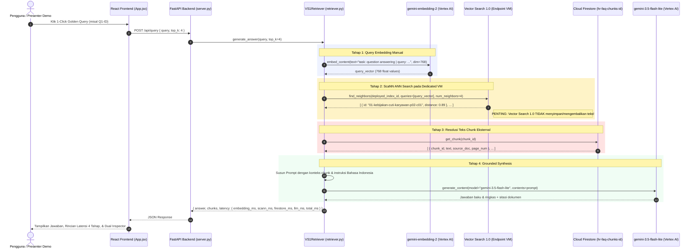

# Skenario 1: Vector Search 1.0 (Versi Indonesia)

Implementasi demo **Skenario 1: Vector Search 1.0** menggunakan Google Cloud Platform untuk paket kebijakan HR PT Cymbal Indonesia berbahasa Indonesia dengan **React 19 + Vite Frontend**, **FastAPI Backend (Port 8001)**, **Vertex AI Matching Engine Index & IndexEndpoint**, **Cloud Firestore (External Text DB)**, dan generasi jawaban dengan **Gemini 3.5 Flash-Lite**.

Lihat dokumen spesifikasi lengkap di [PRD.md](PRD.md) dan dokumen induk [PRD Versi Indonesia](../PRD.md).

---

## 1. Diagram Arsitektur Sistem

Arsitektur ini mendemonstrasikan model **IaaS / Custom RAG** di mana seluruh tahapan *ingestion*, *chunking*, *embedding*, *external document storage*, dan *prompting* kita bangun sendiri. Google Cloud hanya menyediakan mesin pencarian ScaNN ANN dan hosting VM endpoint:

```mermaid
flowchart TD
    subgraph UI["1. Lapisan Presentasi (Frontend - Port 3001 / 8001)"]
        ReactApp["React 19 + Vite Web App<br>- 1-Click Indonesian Golden Test Cards (Q1-ID s.d Q4-ID)<br>- Multi-Stage Latency Breakdown Bar (Embed, ScaNN, Firestore, LLM)<br>- Datapoint ID vs Resolved Text Inspector<br>- Live Endpoint VM & Infrastructure Status Badge"]
    end

    subgraph API["2. Lapisan Aplikasi & API (Backend - Port 8001)"]
        FastAPIServer["FastAPI Server (server.py)<br>- REST Endpoints: /api/query, /api/health, /api/status, /api/documents<br>- Melayani Static React Assets (/dist)"]
        Retriever["VS1Retriever (retriever.py)<br>- Multi-hop Pipeline: Query Embedding → ScaNN Search → Firestore Lookup → LLM"]
        FastAPIServer --> Retriever
    end

    subgraph Ingestion["3. Ingestion Pipeline (Kita Bangun Sendiri)"]
        PDFs["Source Documents (source-documents/)<br>- 01_Kebijakan_Cuti_Karyawan.pdf<br>- 02_Panduan_Tunjangan_2026.pdf<br>- 03_Kebijakan_Perjalanan_Dinas.pdf<br>- 04_FAQ_WFH_WFA.pdf"]
        PyPDF["pypdf Parser (Ekstraksi Teks per Halaman)"]
        Chunker["Sliding Window Chunker (500 karakter, 80 overlap)<br>- Metadata: chunk_id, source_doc, page_num, text"]
        PDFs --> PyPDF --> Chunker
    end

    subgraph ExternalDB["4. External Chunk Text Store (Cloud Firestore)"]
        FS[("Google Cloud Firestore<br>Collection: hr-faq-chunks-id<br>- Kunci: chunk_id<br>- Dokumen: text, source_doc, page_num")]
    end

    subgraph GCP["5. Google Cloud Platform (rag-research-sandbox / us-central1)"]
        subgraph VS1["Vertex AI Vector Search 1.0 (Matching Engine)"]
            Index["Index: hr-faq-index-id<br>- Stream Update (upsert_datapoints)<br>- 768 Dimensi (DOT_PRODUCT_DISTANCE)<br>- ScaNN Tree-AH"]
            Endpoint["IndexEndpoint: hr-faq-endpoint-id<br>- Deployed VM: e2-standard-16 (hr_faq_deployed_id)<br>- Public Endpoint Enabled"]
            Endpoint --> Index
        end

        subgraph GeminiServices["Vertex AI Services (Location: global)"]
            Embedder["gemini-embedding-2 (768d)<br>- Prefix Dokumen: title: ... | text: ...<br>- Prefix Pertanyaan: task: question answering | query: ..."]
            LLM["gemini-3.5-flash-lite<br>- Grounded Indonesian System Instruction"]
        end
    end

    ReactApp <-->|"HTTP REST API"| FastAPIServer
    Chunker -->|"Simpan Teks Payload"| FS
    Chunker -->|"generate_embeddings"| Embedder
    Embedder -->|"upsert_datapoints"| Index
    Retriever -->|"1. Embed Kueri"| Embedder
    Retriever -->|"2. find_neighbors(q_vec)"| Endpoint
    Endpoint -->>|"3. Kembalikan HANYA Datapoint IDs & Jarak"| Retriever
    Retriever -->|"4. batch_get(chunk_ids)"| FS
    FS -->>|"5. Teks Chunk & Metadata Dokumen"| Retriever
    Retriever -->|"6. Grounded Prompt + Chunks"| LLM
    LLM -->>|"7. Jawaban Baku & Sitasi Resmi"| Retriever
```

---

## 2. Alur Eksekusi Query Runtime (Sequence Diagram)

Berikut alur interaksi saat pengguna mengajukan pertanyaan atau mengklik kartu **1-Click Golden Query**:



---

## 3. Matriks Tanggung Jawab: Skenario 1 vs Skenario 2

| Tahapan Pipeline | Skenario 1: Vector Search 1.0 (Implementasi Ini) | Skenario 2: Agent Retrieval (Vector Search 2.0) |
| :--- | :--- | :--- |
| **Ingesti Dokumen** | **Kita Bangun** (`pypdf` membaca berkas lokal PDF) | **Kita Bangun** (`pypdf` membaca berkas lokal PDF) |
| **Chunking Strategy** | **Kita Bangun** (Sliding window 500 karakter, 80 overlap) | **Kita Bangun** (Sliding window 500 karakter, 80 overlap) |
| **Penyimpanan Teks Payload** | **Kita Bangun di Database Terpisah** (Google Cloud Firestore) | **Dikelola Google** (Tersimpan bersama vektor di `DataObject`) |
| **Generasi Embedding** | **Kita Bangun** (Panggilan API manual `gemini-embedding-2`) | **Dikelola Google** (Server-side auto-embedding otomatis) |
| **Infrastruktur Komputasi** | **Dedicated VM Node** (`e2-standard-16`, 20–30 menit deploy) | **Serverless Collection** (Instan, hitungan detik) |
| **Algoritma Pencarian** | **Pure ANN Vector** (ScaNN) | **Hybrid Search** (Dense Semantic + BM25 Sparse + RRF) |
| **Penagihan Biaya** | **Kontinu per jam** selama VM deployed | **Pay-per-query** & ukuran data tersimpan |
| **Jumlah Tahap Runtime** | **4 Tahap** (Embed &rarr; ScaNN &rarr; Firestore &rarr; Gemini) | **2 Tahap** (Search &rarr; Gemini) |

---

## 4. Panduan Menjalankan: 1-Command Spin Up & Teardown

Tersedia skrip otomasi satu-perintah untuk menyalakan dan mematikan seluruh infrastruktur serta server aplikasi:

### 4.1 Menyalakan Sistem (`./spinup.sh`)

```bash
# Menyalakan server lokal & menghubungkan ke GCP (mode hemat biaya / preview instan)
./spinup.sh

# ATAU: Menyalakan server lokal & memicu deployment VM node dedicated e2-standard-16 di GCP
./spinup.sh --deploy-vm
```

Skrip `spinup.sh` secara otomatis:
1. Memverifikasi modul Python dan dependencies frontend React.
2. Memeriksa keberadaan `MatchingEngineIndex`, koleksi Firestore `hr-faq-chunks-id`, dan `MatchingEngineIndexEndpoint` di GCP.
3. Membuka port 8001 dan 3001, lalu menjalankan FastAPI backend dan Vite dev server di latar belakang.
4. Menunggu health check HTTP 200 hingga siap diakses.

Akses dashboard web melalui browser di:
- **Interactive UI**: [http://localhost:3001](http://localhost:3001)
- **FastAPI Backend & Swagger**: [http://localhost:8001/docs](http://localhost:8001/docs)

---

### 4.2 Mematikan & Merapikan Sistem (`./teardown.sh`)

```bash
# Menghentikan server lokal & me-undeploy VM endpoint di GCP (menghentikan tagihan komputasi)
./teardown.sh

# Opsional: Hapus total endpoint dan index dari GCP
./teardown.sh --purge
```

---

### 4.3 Perintah Manual & CLI Tingkat Lanjut

Jika ingin mengelola setiap tahapan secara terpisah:

```bash
# 1. Periksa status Index, Endpoint, status deployment VM, dan koleksi Firestore
python manage_index.py status

# 2. Buat Index Matching Engine (STREAM_UPDATE, 768 dimensi)
python manage_index.py create-index

# 3. Buat IndexEndpoint publik
python manage_index.py create-endpoint

# 4. Deploy index ke endpoint VM (e2-standard-16) — Memerlukan waktu ~20-30 menit
python manage_index.py deploy

# 5. Undeploy index untuk menghentikan biaya VM setelah pengujian/demo selesai!
python manage_index.py undeploy

# 6. Menjalankan pipeline ingesti data
python ingest.py

# 7. Menjalankan evaluasi 4 pertanyaan baku (Golden Queries)
python eval_golden.py
```

---

## 5. Pertanyaan Evaluasi Baku (Golden Queries)

| ID | Kategori Uji | Pertanyaan Pengguna | Dokumen Sumber Target | Topik & Sasaran Pengujian |
| :--- | :--- | :--- | :--- | :--- |
| **Q1-ID** | Semantik Murni | *"Istri saya baru saja melahirkan. Saya dapat libur berapa hari?"* | `01_Kebijakan_Cuti_Karyawan.pdf` (Hal 2) | Menguji *semantic bridging* dari bahasa sehari-hari ("istri melahirkan", "libur") ke istilah resmi "cuti pendampingan persalinan" (5 hari kerja). |
| **Q2-ID** | Kode & Singkatan | *"Formulir PDN-402B itu untuk apa, dan berapa lama batas pengajuannya setelah SPPD selesai?"* | `03_Kebijakan_Perjalanan_Dinas_dan_Reimburse.pdf` (Hal 1) | Menguji batas dense vector murni (tanpa BM25 sparse) dalam menangkap kode formulir `PDN-402B` dan batas 14 hari kalender. |
| **Q3-ID** | Tabel Multikolom | *"Bandingkan plafon rawat jalan per tahun dan tunjangan persalinan caesar antara level Staf dan Manajer."* | `02_Panduan_Tunjangan_dan_Kesehatan_2026.pdf` (Hal 1) | Menguji kemampuan ekstraksi teks tabel `pypdf` vs pemahaman LLM (Staf: RJ 5jt, Caesar 15jt; Manajer: RJ 12jt, Caesar 30jt). |
| **Q4-ID** | Aturan Kebijakan | *"Berapa hari maksimal WFA dalam negeri per tahun dan bagaimana aturan pengajuannya?"* | `04_FAQ_WFH_WFA_dan_Tunjangan_Peralatan.pdf` (Hal 1) | Menguji pencarian aturan WFA (maksimal 20 hari kerja per tahun, pengajuan H-7). |

---

> [!WARNING]
> **Peringatan Biaya GCP:** `MatchingEngineIndexEndpoint` yang di-deploy dengan VM `e2-standard-16` ditagih per jam secara terus-menerus selama berstatus `DEPLOYED`. Selalu jalankan `./teardown.sh` jika demo atau sesi pengujian telah selesai.
