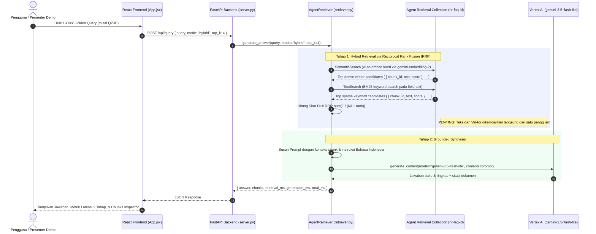

# PRD: Skenario 2 — Agent Retrieval / Vector Search 2.0 (Versi Indonesia)
**Cymbal Corp HR FAQ Agent — Demo Perbandingan Arsitektur Retrieval & Search Google Cloud**

* **Penulis:** xavierprasetyo
* **Tanggal:** 6 Oktober 2026
* **Status:** Disetujui
* **Dokumen Induk:** [indonesia-version/PRD.md](../PRD.md)
* **GCP Project:** `rag-research-sandbox` (Project Number: `1031440951381`)
* **Region / Location:** `us-central1` (Collection), `global` (Gemini API & LLM)

---

## 1. Ringkasan Eksekutif & Tujuan

Skenario 2 mendemonstrasikan implementasi **Google Cloud Agent Retrieval** (sebelumnya dikenal sebagai Vertex AI Vector Search 2.0 / Serverless Collections via `vectorsearch.googleapis.com`). Berbeda dengan Skenario 1 (Vector Search 1.0) yang berfokus pada IaaS tingkat rendah dan mengharuskan developer mengelola database eksternal serta node VM dedicated, Agent Retrieval menghadirkan **arsitektur terkelola (PaaS / Serverless)** yang mengotomatisasi tahapan penting dalam pipeline RAG:

1. **Penyimpanan Terpadu (Unified Storage):** Dokumen teks mentah dan vektor embedding disimpan bersama di dalam satu container serverless (`Collection` & `DataObjects`). Developer **tidak memerlukan database eksternal** (seperti Firestore atau Cloud SQL) untuk menerjemahkan ID menjadi teks.
2. **Auto-Embedding Otomatis:** Vektor embedding dibuat secara otomatis di sisi server Google Cloud menggunakan model fondasi `gemini-embedding-2` (768 dimensi) melalui konfigurasi deklaratif `vertex_embedding_config`. Developer cukup mengirimkan payload data teks, dan Google menangani pembuatan embedding dan pengindeksan.
3. **Pencarian Multi-Mode (Hybrid Search):** Mendukung pencarian semantik vektor padat (`SemanticSearch`), pencarian kata kunci leksikal BM25 (`TextSearch`), dan fusi peringkat timbal balik (**Reciprocal Rank Fusion / RRF**) secara native.
4. **Infrastruktur Serverless:** Tidak memerlukan provisi dedicated VM node (seperti `e2-standard-16` pada Skenario 1 yang memakan waktu 20–30 menit). Koleksi langsung aktif dalam hitungan detik dengan model penagihan berbasis konsumsi (*pay-per-query*).

Tujuan aplikasi ini adalah menyediakan implementasi *full-stack* yang fungsional, transparan, dan dapat diuji secara langsung, mencakup manajemen koleksi serverless, pipeline ingesti DataObjects, REST API FastAPI, antarmuka web interaktif (React + Vite), serta evaluasi otomatis atas pertanyaan baku (Golden Queries).

---

## 2. Diagram Arsitektur & Alur Data

### 2.1 Arsitektur Komponen

```mermaid
flowchart TD
    subgraph ClientLayer["1. Lapisan Presentasi (Frontend - Port 3000 / 8000)"]
        UI["React 19 + Vite Web App<br>- 1-Click Indonesian Golden Test Cards (Q1-ID s.d Q4-ID)<br>- Search Mode Pill Selector (Hybrid RRF / Semantic / BM25 Text)<br>- Latency KPI Dashboard (Retrieval ms, LLM ms, Total ms)<br>- Chunks & Similarity Inspector (Score, RRF Rank, Source Doc)<br>- Document Browser & Benchmark Results Table"]
    end

    subgraph ServiceLayer["2. Lapisan Aplikasi & API (Backend - Port 8000)"]
        FastAPIApp["FastAPI Server (server.py - Port 8000)<br>- REST Endpoints: /api/query, /api/health, /api/status, /api/documents, /api/benchmark<br>- Melayani Static React Assets (/dist)"]
        RetrieverCore["AgentRetriever (retriever.py)<br>- Multi-Mode Engine: SemanticSearch, TextSearch, Hybrid RRF<br>- Grounded Prompt Assembly & Gemini Invocation"]
        FastAPIApp --> RetrieverCore
    end

    subgraph IngestionLayer["3. Ingestion Pipeline (Kita Bangun Sendiri)"]
        PDFs["Source Documents (source-documents/)<br>- 01_Kebijakan_Cuti_Karyawan.pdf<br>- 02_Panduan_Tunjangan_2026.pdf<br>- 03_Kebijakan_Perjalanan_Dinas.pdf<br>- 04_FAQ_WFH_WFA.pdf"]
        PyPDF["pypdf Parser (Ekstraksi Teks per Halaman)"]
        Chunker["Sliding Window Chunker (500 karakter, 80 overlap)<br>- Metadata: chunk_id, source_doc, page_num, text"]
        PDFs --> PyPDF --> Chunker
    end

    subgraph GCPCompute["4. Google Cloud Platform (rag-research-sandbox / us-central1)"]
        subgraph ServerlessVS2["Agent Retrieval (Vector Search 2.0)"]
            Col["Collection: hr-faq-id (us-central1)<br>- Status: ACTIVE (Serverless)"]
            AutoEmbed["Auto-Embedding Engine<br>- Model: gemini-embedding-2 (768d)<br>- Template: title: {source_doc} | text: {text}"]
            Store[("DataObjects Store<br>- Teks JSON Payload & Vektor Tersimpan Bersama")]
            Col --- AutoEmbed
            AutoEmbed --> Store
        end

        subgraph GeminiServices["Vertex AI Foundational Services (Location: global)"]
            GeminiLLM["gemini-3.5-flash-lite<br>- Grounded Indonesian System Instruction"]
        end
    end

    UI <-->|"HTTP REST API"| FastAPIApp
    Chunker -->|"CreateDataObject"| Col
    RetrieverCore -->|"1. SearchDataObjects (Hybrid / Semantic / Text)"| Store
    Store -->>|"2. DataObject Payloads (Teks & Skor Sekaligus)"| RetrieverCore
    RetrieverCore -->|"3. Grounded Prompt + Chunks"| GeminiLLM
    GeminiLLM -->>|"4. Jawaban Baku & Sitasi Resmi"| RetrieverCore
```

---

### 2.2 Diagram Alur Query Runtime (Sequence Diagram)

Berikut alur interaksi saat pengguna mengajukan pertanyaan atau mengklik kartu **1-Click Golden Query**:



---

## 3. Matriks Tanggung Jawab: Skenario 1 vs Skenario 2

| Dimensi Arsitektural | Skenario 1: Vector Search 1.0 | Skenario 2: Agent Retrieval (Implementasi Ini) |
| :--- | :--- | :--- |
| **Model Layanan** | IaaS / Primitif Vektor Murni | PaaS / Serverless Vector Container |
| **Penyimpanan Teks Payload** | **Terpisah**: Wajib database eksternal (Cloud Firestore) | **Terpadu**: Disimpan bersama vektor di `DataObjects` |
| **Generasi Vektor (Embedding)** | **Manual**: Panggilan API `gemini-embedding-2` per chunk | **Otomatis**: Dikelola server via `vertex_embedding_config` |
| **Provisi Komputasi** | **Dedicated VM**: `e2-standard-16` (20–30 menit deploy) | **Serverless**: Instan (aktif dalam hitungan detik) |
| **Model Penagihan Biaya** | Kontinu per jam selama VM aktif ($/jam) | Berbasis konsumsi (*pay-per-query* & ukuran data) |
| **Algoritma Pencarian** | Pure Dense ANN (ScaNN Tree-AH) | **Hybrid Search**: Dense Vector + BM25 Sparse + RRF |
| **Jumlah Hop Runtime** | **4 Hop**: Embed &rarr; ScaNN &rarr; Firestore Lookup &rarr; LLM | **2 Hop**: Search &rarr; LLM |
| **Kelemahan Kode/Simbol (Q2-ID)** | Rentan meleset pada kode formulir (dense only) | **Akurat**: BM25 menangkap kode tepat (`PDN-402B`) |

---

## 4. Spesifikasi Teknis & Skema Data

### 4.1 Skema Collection (`hr-faq-id`)

```json
{
  "display_name": "Cymbal HR FAQ Indonesia",
  "description": "Koleksi Kebijakan HR PT Cymbal Indonesia (Auto-Embedding gemini-embedding-2)",
  "data_schema": {
    "type": "object",
    "properties": {
      "chunk_id": { "type": "string" },
      "source_doc": { "type": "string" },
      "page_num": { "type": "number" },
      "text": { "type": "string" }
    }
  },
  "vector_schema": {
    "embedding": {
      "dense_vector": {
        "dimensions": 768,
        "vertex_embedding_config": {
          "model_id": "gemini-embedding-2",
          "text_template": "title: {source_doc} | text: {text}",
          "task_type": "RETRIEVAL_DOCUMENT"
        }
      }
    }
  }
}
```

### 4.2 Formulasi Fusi Peringkat Timbal Balik (Reciprocal Rank Fusion - RRF)

Pencarian *Hybrid* menggabungkan peringkat hasil dari saluran *SemanticSearch* dan saluran *TextSearch* menggunakan rumus matematis standar:

$$\text{RRF\_Score}(d) = \sum_{m \in \{\text{semantic}, \text{text}\}} \frac{1}{k + \text{rank}_m(d)}$$

Di mana:
- $k = 60$ (konstanta penghalus peringkat standar industri).
- $\text{rank}_m(d)$ adalah posisi dokumen $d$ pada saluran $m$ (1-indexed).
- Dokumen dengan nilai $\text{RRF\_Score}$ tertinggi disajikan ke LLM sebagai konteks utama.

---

## 5. Pertanyaan Evaluasi Baku (Golden Queries)

| ID | Kategori Uji | Pertanyaan Pengguna | Dokumen Sumber Target | Topik & Perilaku yang Diharapkan |
| :--- | :--- | :--- | :--- | :--- |
| **Q1-ID** | Semantik Murni | *"Istri saya baru saja melahirkan. Saya dapat libur berapa hari?"* | `01_Kebijakan_Cuti_Karyawan.pdf` (Hal 2) | Menjembatani bahasa sehari-hari ("istri melahirkan", "libur") ke istilah resmi "cuti pendampingan persalinan" (5 hari kerja). Berhasil baik di mode Semantic maupun Hybrid. |
| **Q2-ID** | Kode & Singkatan | *"Formulir PDN-402B itu untuk apa, dan berapa lama batas pengajuannya setelah SPPD selesai?"* | `03_Kebijakan_Perjalanan_Dinas_dan_Reimburse.pdf` (Hal 1) | **Uji Trade-off Utama:** Mode Hybrid (BM25) langsung mencocokkan kode `PDN-402B` dan batas 14 hari kalender, mengungguli dense murni yang sering kali mengaburkan kode unik. |
| **Q3-ID** | Tabel Multikolom | *"Bandingkan plafon rawat jalan per tahun dan tunjangan persalinan caesar antara level Staf dan Manajer."* | `02_Panduan_Tunjangan_dan_Kesehatan_2026.pdf` (Hal 1) | Menguji kemampuan ekstraksi teks tabel `pypdf` vs pemahaman LLM (Staf: RJ 5jt, Caesar 15jt; Manajer: RJ 12jt, Caesar 30jt). |
| **Q4-ID** | Aturan Kebijakan | *"Berapa hari maksimal WFA dalam negeri per tahun dan bagaimana aturan pengajuannya?"* | `04_FAQ_WFH_WFA_dan_Tunjangan_Peralatan.pdf` (Hal 1) | Menguji pencarian aturan WFA (maksimal 20 hari kerja per tahun, pengajuan H-7). |

---

## 6. Spesifikasi Antarmuka & REST API

### 6.1 Endpoints Backend (FastAPI - Port 8000)

* `GET /api/health`: Memeriksa kesehatan server, konfigurasi model, dan ID collection.
* `GET /api/status`: Mengembalikan metadata live dari collection GCP via `manage_collection.py`.
* `GET /api/documents`: Mengembalikan katalog 4 dokumen PDF kebijakan HR.
* `GET /api/golden-queries`: Mengembalikan 4 kartu pertanyaan uji baku.
* `GET /api/benchmark`: Mengembalikan riwayat hasil benchmark dari `eval_results.json`.
* `POST /api/query`: Memproses kueri dengan parameter:
  ```json
  {
    "query": "Formulir PDN-402B itu untuk apa?",
    "mode": "hybrid",  // pilihan: "hybrid" | "semantic" | "text"
    "top_k": 4
  }
  ```

### 6.2 Antarmuka Pengguna (React 19 + Vite - Port 3000)

* **1-Click Golden Test Cards**: Menjalankan kueri uji dalam 1 klik tanpa perlu mengetik manual.
* **Pill Mode Selector**: Beralih instan antara mode *Hybrid (RRF)*, *Semantic (Dense)*, dan *Text (BM25)* untuk memperlihatkan perbedaan hasil pencarian secara langsung kepada audiens demo.
* **Latency KPI Dashboard**: Kartu metrik latensi 2 tahap (Retrieval ms, LLM Generation ms, Total ms).
* **Chunks & Source Inspector**: Menampilkan isi potongan dokumen asli, nomor halaman, dan skor relevansi/RRF.
* **Benchmark Tab**: Menampilkan tabel perbandingan metrik resmi hasil evaluasi otomatis.

---

## 7. Otomasi Eksekusi & Siklus Hidup

Tersedia skrip otomasi satu-perintah:

```bash
# Menyalakan seluruh server lokal & memverifikasi koleksi GCP:
./spinup.sh

# Menghentikan server lokal:
./teardown.sh

# Menghapus total koleksi dari GCP (opsional):
./teardown.sh --purge

# CLI Manajemen Koleksi:
python manage_collection.py status
python manage_collection.py reingest
```

---

## 8. Kriteria Penerimaan (Acceptance Criteria)

1. [x] Koleksi `hr-faq-id` terkonfigurasi dengan auto-embedding `gemini-embedding-2` di region `us-central1`.
2. [x] Seluruh 33 chunk teks berhasil tersimpan sebagai `DataObjects` bersama vektornya di GCP.
3. [x] Pencarian mendukung mode `hybrid`, `semantic`, dan `text` via `retriever.py`.
4. [x] Evaluasi otomatis `eval_golden.py` mencapai kelulusan 100% pada 4 pertanyaan emas.
5. [x] Skrip `./spinup.sh` dan `./teardown.sh` dapat dieksekusi dengan satu perintah tanpa error.
