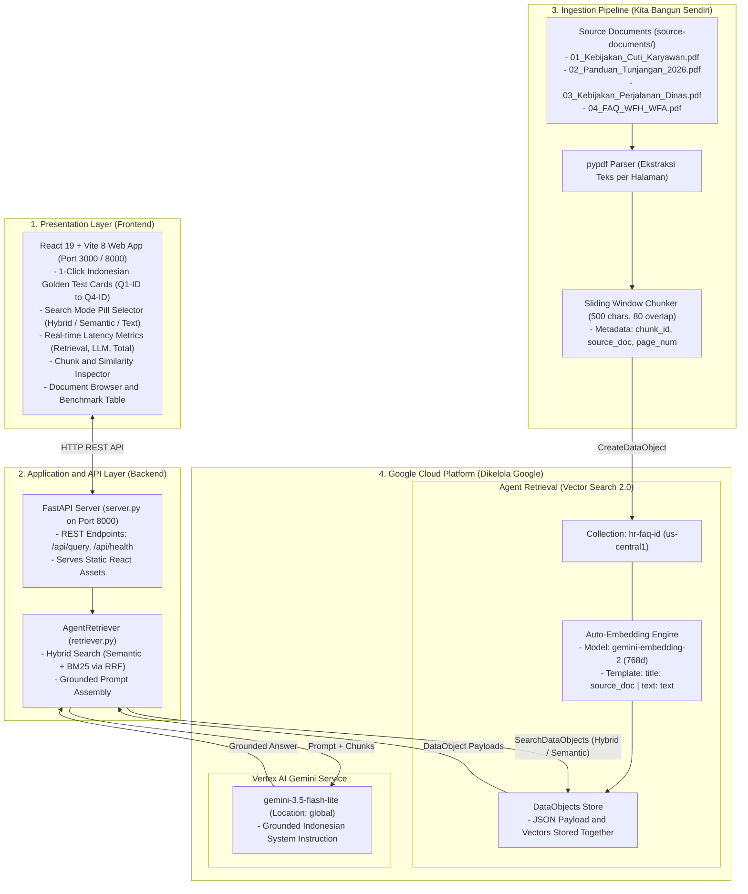
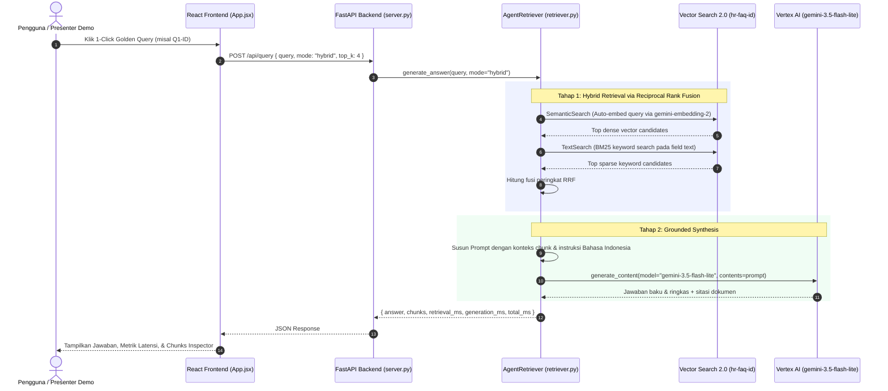

# Skenario 2: Agent Retrieval (Vector Search 2.0) — Versi Indonesia

Implementasi demo **Skenario 2: Agent Retrieval** (sebelumnya Vector Search 2.0) menggunakan Google Cloud Platform untuk paket kebijakan HR PT Cymbal Indonesia berbahasa Indonesia dengan **React + Vite Frontend** dan engine generasi **Gemini 3.5 Flash-Lite**.

Lihat dokumen spesifikasi lengkap di [PRD.md](PRD.md) dan dokumen induk [PRD Versi Indonesia](../PRD.md).

---

## 1. Diagram Arsitektur Sistem

Arsitektur ini mendemonstrasikan bagaimana **Agent Retrieval** menyederhanakan pipeline RAG dengan mengintegrasikan penyimpanan teks dokumen dan vektor embedding ke dalam satu container serverless (`Collection` & `DataObjects`), disertai auto-embedding otomatis oleh Google Cloud:



---

## 2. Alur Eksekusi Query (Sequence Diagram)

Berikut alur interaksi saat pengguna mengetik pertanyaan atau mengklik kartu **1-Click Golden Query**:



---

## 3. Matriks Tanggung Jawab & Trade-off Arsitektural

| Tahapan Pipeline | Siapa yang Membangun | Implementasi di Skenario 2 | Perbandingan vs Vector Search 1.0 |
| :--- | :--- | :--- | :--- |
| **Ingesti Dokumen** | **Kita Bangun** | `ingest.py` membaca berkas lokal PDF di `source-documents/` | Sama (membaca berkas lokal) |
| **Parsing PDF & Tabel** | **Kita Bangun** | Ekstraksi teks menggunakan pustaka `pypdf` | Sama (tanggung jawab developer) |
| **Strategi Chunking** | **Kita Bangun** | Pembagi teks sliding window (500 karakter, 80 overlap) | Sama (tanggung jawab developer) |
| **Pembuatan Vektor (Embedding)** | **Google Kelola** | Otomatis dibuat oleh server via `gemini-embedding-2` (768 dimensi) melalui `vertex_embedding_config` | **Lebih Baik**: VS 1.0 mengharuskan developer memanggil API embedding secara terpisah |
| **Penyimpanan Teks Chunk** | **Google Kelola** | Disimpan langsung di dalam `DataObjects` bersama vektornya | **Jauh Lebih Baik**: VS 1.0 hanya menyimpan vektor ID, membutuhkan database teks eksternal terpisah (Firestore / Cloud SQL) |
| **Provisi Infrastruktur** | **Google Kelola** | Serverless `Collection` instan (aktif dalam hitungan detik) | **Jauh Lebih Cepat**: VS 1.0 membutuhkan 20–40 menit provisi VM `IndexEndpoint` |
| **Pencarian Hybrid** | **Google & Kita** | `SemanticSearch` (vektor padat) + `TextSearch` (BM25) digabung dengan Reciprocal Rank Fusion (RRF) | **Lebih Fleksibel**: VS 1.0 murni ANN kecuali sparse vector dibangun manual |
| **Sintesis Jawaban** | **Kita Bangun** | `retriever.py` merangkai prompt dan memanggil `gemini-3.5-flash-lite` di lokasi `global` | Sama |

---

## 4. Spesifikasi Komponen & Resource

| Komponen | Spesifikasi / Nilai |
| :--- | :--- |
| **GCP Project** | `rag-research-sandbox` (Project Number: `1031440951381`) |
| **Folder & Billing** | Folder `default` (`535427245754`), Billing `0144CC-5C8DC9-05B66D` |
| **Region / Lokasi** | `us-central1` (Collection), `global` (Gemini 3.5 Flash-Lite & Gemini Embedding 2) |
| **API Endpoint** | `vectorsearch.googleapis.com/v1` (`google-cloud-vectorsearch`) |
| **Resource Collection** | `projects/rag-research-sandbox/locations/us-central1/collections/hr-faq-id` |
| **Model Auto-Embedding** | `gemini-embedding-2` (768 dimensi, `task_type=RETRIEVAL_DOCUMENT`) |
| **Template Embedding** | `title: {source_doc} | text: {text}` |
| **Model LLM Generasi** | `gemini-3.5-flash-lite` via Vertex AI Client |
| **Frontend Stack** | React 19, Vite 8, Tailwind CSS v4, Lucide React |
| **Backend API** | FastAPI 0.115, Uvicorn, Python 3.13 |

---

## 5. Struktur Berkas Repository

```
indonesia-version/02-agent-retrieval/
├── PRD.md                  # Dokumen spesifikasi teknis lengkap Skenario 2
├── README.md               # Dokumentasi arsitektur & panduan eksekusi
├── spinup.sh               # Skrip 1-command untuk menjalankan seluruh sistem (Port 8000 & 3000)
├── teardown.sh             # Skrip 1-command untuk mematikan server lokal & opsional purge
├── manage_collection.py    # CLI manajemen status, pembuatan, & penghapusan koleksi di GCP
├── requirements.txt        # Dependensi Python (vectorsearch, genai, fastapi, uvicorn, pypdf, rich)
├── config.py               # Konfigurasi project, region, collection, model, dan golden queries
├── ingest.py               # Pembuat collection otomatis, parser PDF, dan pipeline chunking
├── retriever.py            # Modul retrieval (Semantic, BM25 Text, Hybrid RRF) dan sintesis LLM
├── eval_golden.py          # Script benchmark CLI untuk menguji Q1-ID s/d Q4-ID
├── eval_results.json       # Log hasil benchmark dan metrik latensi
├── chunks_cache.json       # Cache lokal 33 chunk yang diindeks
├── server.py               # FastAPI backend (Port 8000) & static server
└── frontend/               # React + Vite application (Port 3000)
    ├── src/
    │   ├── App.jsx         # UI interaktif dengan 1-click golden test cards & pill mode selector
    │   └── index.css       # Tailwind CSS v4 styling
    ├── vite.config.js      # Konfigurasi Vite & proxy API ke port 8000
    └── package.json        # Dependensi npm React & Vite
```

---

## 6. Cara Menjalankan: 1-Command Spin Up & Teardown

Tersedia skrip otomasi satu-perintah untuk menyalakan dan mematikan seluruh infrastruktur serta server aplikasi:

### 6.1 Menyalakan Sistem (`./spinup.sh`)

```bash
cd indonesia-version/02-agent-retrieval
./spinup.sh
```

Skrip `spinup.sh` secara otomatis:
1. Memverifikasi modul Python dan dependencies frontend React.
2. Memeriksa keberadaan `Collection: hr-faq-id` di GCP dan koleksi DataObjects (menjalankan ingesti jika belum ada).
3. Membuka port 8000 dan 3000, lalu menjalankan FastAPI backend dan Vite dev server di latar belakang.
4. Menunggu health check HTTP 200 hingga siap diakses.

Akses dashboard web melalui browser di:
- **Interactive UI**: [http://localhost:3000](http://localhost:3000)
- **FastAPI Backend & Swagger**: [http://localhost:8000/docs](http://localhost:8000/docs)
- **Status Koleksi GCP**: [http://localhost:8000/api/status](http://localhost:8000/api/status)

---

### 6.2 Mematikan Sistem (`./teardown.sh`)

```bash
# Menghentikan server lokal (Koleksi serverless tetap tersimpan dengan $0/jam biaya komputasi):
./teardown.sh

# Opsional: Hapus total koleksi dari GCP
./teardown.sh --purge
```

---

### 6.3 Perintah Manual & CLI Manajemen Koleksi (`manage_collection.py`)

Jika ingin memeriksa status atau mengelola koleksi GCP secara terpisah:

```bash
# 1. Periksa status koleksi GCP dan jumlah chunk terindeks:
python manage_collection.py status

# 2. Buat koleksi jika belum ada:
python manage_collection.py create

# 3. Jalankan ulang pipeline ingesti:
python manage_collection.py reingest

# 4. Jalankan evaluasi benchmark CLI (4 Golden Queries):
python eval_golden.py
```

---

## 7. Hasil Uji Golden Queries (Benchmark Metrics)

Berdasarkan pengujian resmi pada Google Cloud Project `rag-research-sandbox`:

| ID Query | Kategori | Mode | Dokumen Terpilih | Status | Retrieval Latency | LLM Latency (Gemini 3.5 Flash-Lite) | Total |
| :--- | :--- | :--- | :--- | :---: | :---: | :---: | :---: |
| **Q1-ID** | Semantik (*Cuti melahirkan suami*) | HYBRID | `01_Kebijakan_Cuti_Karyawan.pdf` (Hal 2) | ✅ PASS | ~380–700 ms | ~1850 ms | ~2500 ms |
| **Q2-ID** | Kode & Singkatan (`PDN-402B`, `SPPD`) | HYBRID | `03_Kebijakan_Perjalanan_Dinas_dan_Reimburse.pdf` (Hal 1) | ✅ PASS | ~730 ms | ~1900 ms | ~2630 ms |
| **Q2-ID** | Kode & Singkatan (`PDN-402B`, `SPPD`) | SEMANTIC | `03_Kebijakan_Perjalanan_Dinas_dan_Reimburse.pdf` (Hal 1) | ✅ PASS | ~380 ms | ~1880 ms | ~2260 ms |
| **Q3-ID** | Tabel Multikolom (*Rawat jalan & Caesar*) | HYBRID | `02_Panduan_Tunjangan_dan_Kesehatan_2026.pdf` (Hal 1) | ✅ PASS | ~670 ms | ~1750 ms | ~2420 ms |
| **Q4-ID** | Policy Retrieval (*WFA 20 hari, H-7*) | HYBRID | `04_FAQ_WFH_WFA_dan_Tunjangan_Peralatan.pdf` (Hal 1) | ✅ PASS | ~740 ms | ~1920 ms | ~2660 ms |

---

## 8. Fitur UI React Baru

1. **1-Click Golden Test Cards**: 4 kartu pertanyaan emas PRD (Q1-ID Semantik, Q2-ID Kode PDN-402B, Q3-ID Tabel Plafon, Q4-ID Aturan WFA) yang langsung mengeksekusi retrieval dan menampilkan jawaban secara instan tanpa perlu reload.
2. **Pill Mode Selector**: Beralih instan antara *Hybrid Search (RRF)*, *Pure Semantic (`gemini-embedding-2`)*, dan *Keyword BM25*.
3. **Latency KPI Dashboard**: Kartu metrik real-time yang memisahkan waktu retrieval milidetik dan waktu generasi LLM (`gemini-3.5-flash-lite`).
4. **Chunks & Source Inspector**: Melihat kutipan teks asli, peringkat RRF, nomor halaman, dan ID chunk secara transparan.
5. **Perpustakaan Dokumen**: Tab khusus untuk meninjau 4 dokumen kebijakan HR PT Cymbal Indonesia.
6. **Benchmark Tab**: Tabel perbandingan hasil uji resmi golden queries.
